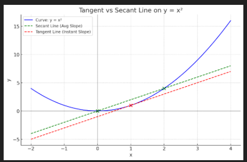

Absolutely! Here's a **complete summary chart** of today's discussion on **dominance of functions**, **limits**, and **growth comparison**, including clear examples and explanation for each type.

---

## 🧠 **Hierarchy of Growth (from slowest to fastest):**

This helps you understand which function "dominates" or "grows faster" as $x \to \infty$

| Rank | Type of Function    | Example                   | Notes                                                   |
| ---- | ------------------- | ------------------------- | ------------------------------------------------------- |
| 1ï¸âƒ£   | **Constant**        | $5, \ 42, \ \pi$          | Doesn't grow with $x$; always fixed                     |
| 2ï¸âƒ£   | **Logarithmic**     | $\ln x,\ \log_{10} x$     | Grows **very slowly**; slower than any power            |
| 3ï¸âƒ£   | **Polynomial root** | $\sqrt{x},\ x^{1/n}$      | Grows faster than log, but slower than full polynomials |
| 4ï¸âƒ£   | **Polynomial**      | $x, \ x^2, \ x^3$         | Medium growth; degree matters                           |
| 5ï¸âƒ£   | **Exponential**     | $2^x,\ e^x,\ 10^x$        | Grows **much faster** than any polynomial               |
| 6ï¸âƒ£   | **Factorial**       | $x!,\ n!$                 | Grows **even faster** than exponentials                 |
| 7ï¸âƒ£   | **Power Tower**     | $x^x,\ a^{x^2},\ e^{e^x}$ | Grows **extremely fast** – faster than all the rest     |

---

## 🔠**Comparison Summary:**

| As $x \to \infty$...                | Dominant Term                   | Reason                        |
| ----------------------------------- | ------------------------------- | ----------------------------- |
| $\frac{\ln x}{x} \to 0$             | $x$ dominates $\ln x$           | Log grows slowly              |
| $\frac{x^2}{e^x} \to 0$             | $e^x$ dominates $x^2$           | Exponential beats polynomials |
| $\frac{x}{x^2} = \frac{1}{x} \to 0$ | $x^2$ dominates $x$             | Higher power wins             |
| $\frac{\ln x}{x^k} \to 0$           | Polynomial dominates log        | True for any $k > 0$          |
| $\frac{e^x}{x!} \to 0$              | Factorial dominates exponential | $x!$ grows faster than $e^x$  |

---

## 🧪 **Special Limit Forms:**

| Form                      | Name                | Example                          | Can be Resolved?             |
| ------------------------- | ------------------- | -------------------------------- | ---------------------------- |
| $\frac{0}{0}$             | **Indeterminate**   | $\frac{x-2}{x^2 - 4}$            | Yes, use L'Hôpital or factor |
| $\frac{\infty}{\infty}$   | **Indeterminate**   | $\frac{e^x}{x^2}$                | Yes, use L'Hôpital           |
| $\frac{0}{\infty}$        | **Determinate (0)** | $\frac{\ln x}{x^2}$              | Yes, equals 0                |
| $\infty - \infty$         | **Indeterminate**   | $\sqrt{x^2 + x} - x$             | Yes, rationalize             |
| $0 \cdot \infty$          | **Indeterminate**   | $x \cdot \ln x$                  | Yes, rewrite as division     |
| $1^\infty, 0^0, \infty^0$ | **Indeterminate**   | $\left(1 + \frac{1}{x}\right)^x$ | Yes, use logarithms          |

---

## âœ³ï¸ **Important Concepts Discussed Today:**

| Concept              | Brief Explanation                                                             |
| -------------------- | ----------------------------------------------------------------------------- |
| $\sqrt{9} = 3$       | By convention, **principal square root** is positive                          |
| $\sqrt{-1}$          | Not real — it’s **imaginary** → $i$                                           |
| $\ln(a^b) = b \ln a$ | Logarithmic identity: powers can be pulled in front                           |
| $e^{-\infty} = 0$    | Exponential decays to 0 for negative infinity                                 |
| $\tan(0) = 0$        | From unit circle: opposite = 0                                                |
| L'Hôpital's Rule     | For indeterminate forms like $\frac{0}{0}$, take derivative of top and bottom |
| Dominance order      | $\ln x \ll x^a \ll a^x \ll x! \ll x^x$ as $x \to \infty$                      |

---

## 📌 **Conclusion — Dominance Order Chart**

| Function Type | Symbol    | Order of Growth (from low to high) |
| ------------- | --------- | ---------------------------------- |
| Constant      | c         | Slowest                            |
| Logarithmic   | $\ln x$   |                                    |
| Root          | $x^{1/n}$ |                                    |
| Polynomial    | $x^a$     |                                    |
| Exponential   | $a^x$     |                                    |
| Factorial     | $x!$      |                                    |
| Power Tower   | $x^x$     | Fastest                            |

---

Sure! Here's the **completed comparison table** showing the **order of growth** (or dominance) of common mathematical functions, from the **slowest-growing** to the **fastest-growing**, as $x \to \infty$:

| Function Type | Symbol                      | Order of Growth (from low to high) |
| ------------- | --------------------------- | ---------------------------------- |
| Constant      | $c$                         | Slowest                            |
| Logarithmic   | $\ln x$, $\log x$           |                                    |
| Root          | $x^{1/n}$ (e.g. $\sqrt{x}$) |                                    |
| Polynomial    | $x^a$ (e.g. $x^2, x^3$)     |                                    |
| Exponential   | $a^x$ (e.g. $2^x, e^x$)     |                                    |
| Factorial     | $x!$                        |                                    |
| Power Tower   | $x^x$ or $a^{a^x}$          | Fastest                            |

### Extra Intuition:

- **Constant**: Doesn’t change, like 5.
- **Logarithmic**: Grows very slowly even as $x \to \infty$.
- **Root**: Grows faster than log, but slower than linear.
- **Polynomial**: Depends on the power. $x^2$ grows slower than $x^3$, etc.
- **Exponential**: Shoots up rapidly, e.g., $2^x$, $e^x$.
- **Factorial**: Grows faster than exponentials (e.g., $5! = 120$, $10! = 3,628,800$).
- **Power Tower**: Explodes in size! $x^x$, $x^{x^x}$, etc.

Let me know if you'd like a **graphical intuition**, **real-life analogy**, or **limit comparison examples** between them.

---

Great! Let's understand what **continuity** means in simple terms — no jargon, just intuition + math when needed.

---

### 🯠**Continuity (Simple Idea)**

A function is **continuous at a point** if:

> â— You can draw its graph at that point **without lifting your pen**.

That’s it — no jumps, no holes, no breaks.

---

### 🧠 More formally, a function $f(x)$ is **continuous at a point $x = a$** if all 3 of these are true:

1. ✅ $f(a)$ is **defined** (the point exists).
2. ✅ The **limit** $\lim_{x \to a} f(x)$ **exists**.
3. ✅ The value of the function **equals** the limit:

   $$
   \lim_{x \to a} f(x) = f(a)
   $$

---

### 📈 Visually:

- **Continuous**: The graph is smooth at that point.
- **Discontinuous**: The graph has a **jump**, **hole**, or **asymptote**.

---

### 🔠Types of discontinuities:

1. **Jump discontinuity** – sudden jump in the graph.
2. **Hole/removable** – a missing point (like dividing by 0).
3. **Infinite/discontinuity** – graph shoots to ∠or −âˆ.

---

### ✅ Examples:

- $f(x) = x^2 + 1$ — **Continuous** everywhere.
- $f(x) = \frac{1}{x}$ — Not continuous at $x = 0$ (because undefined there).
- Piecewise-defined functions may or may not be continuous at the point where the pieces switch.

---

## Would you like to see examples of both **continuous and discontinuous graphs** or how to check continuity in a **piecewise** function?

Let’s break this problem down clearly and calmly.

---

### â“ **Given:**

A piecewise function:

$$
f(x) =
\begin{cases}
x + a & \text{if } x < 2 \\
ax^2 - 3 & \text{if } x \geq 2
\end{cases}
$$

You're asked to **find all values of $a$** such that **$f(x)$ is continuous** on the entire real line (i.e., from $-\infty$ to $\infty$).

---

### ✅ Step-by-step explanation:

For a piecewise function to be **continuous** everywhere, especially at the point where the pieces **change** (i.e., **at $x = 2$**), you must ensure:

$$
\lim_{x \to 2^-} f(x) = \lim_{x \to 2^+} f(x) = f(2)
$$

So we’ll **calculate both limits** and make them equal.

---

### 🔹 Step 1: Left-hand limit ($x \to 2^-$)

Use the **first piece** $f(x) = x + a$:

$$
\lim_{x \to 2^-} f(x) = 2 + a
$$

---

### 🔹 Step 2: Right-hand limit ($x \to 2^+$)

Use the **second piece** $f(x) = ax^2 - 3$:

$$
\lim_{x \to 2^+} f(x) = a(2)^2 - 3 = 4a - 3
$$

---

### 🔹 Step 3: Set both equal (continuity condition):

$$
2 + a = 4a - 3
$$

---

### 🔹 Step 4: Solve for $a$:

$$
2 + a = 4a - 3 \\
2 + 3 = 4a - a \\
5 = 3a \Rightarrow a = \frac{5}{3}
$$

---

### ✅ Final Answer:

$$
\boxed{a = \frac{5}{3}}
$$

This is the **only value of $a$** that makes the function **continuous** on the entire real number line.

Let me know if you’d like a **graph sketch** or **intuitive analogy** to help you remember how this works.

---

Great question! Let’s break it down clearly and simply.

---

### â“Why is a **polynomial function** always continuous?

---

### ✅ What is a **polynomial**?

A polynomial is a function made of terms like this:

$$
f(x) = a_nx^n + a_{n-1}x^{n-1} + \dots + a_1x + a_0
$$

Examples:

- $f(x) = 3x^2 + 2x + 1$
- $f(x) = x^5 - 4x^3 + 7$

---

### ✅ Why are they continuous?

Because **all the operations** used in polynomials are continuous:

- Addition ✅
- Subtraction ✅
- Multiplication ✅
- Powers with whole-number exponents ✅

So, no matter what $x$ you choose, the output $f(x)$ can be calculated **smoothly without any jumps, holes, or breaks**.

---

### 🧠 Intuition:

You can **draw** a polynomial curve **without lifting your pen** from the paper.
That’s exactly what it means to be continuous.

---

### 🚫 What causes discontinuity then?

Functions like:

- Piecewise functions (where definitions change at a point)
- Rational functions (division — can cause undefined values)
- Functions with roots or logs (which have domain restrictions)

Polynomials **don’t involve division or undefined zones** — that’s why they’re always continuous.

---

### ✅ Summary:

Polynomials are continuous **everywhere** on $(-\infty, \infty)$ because they are built from basic continuous operations that never "break" or become undefined.

Let me know if you want a **visual graph comparison** or want to contrast this with **non-continuous functions**.

---

Great follow-up! Let's answer this **step by step** based on your earlier question:

---

### 🤔 Why do we **suspect** a function might **not** be continuous at $x = 2$?

Because the function is defined **piecewise** — it has **different expressions on different intervals**:

> For example:
>
> $$
> $$

f(x) =
\begin{cases}
x + a & \text{if } x < 2 \\
ax^2 - 3 & \text{if } x \geq 2
\end{cases}
]

Whenever a function **changes its formula** at a point (like at $x = 2$ here), we **must check** if the left and right sides "meet" smoothly at that point.

---

### 🧪 Why check at $x = 2$?

- For $x < 2$, it’s defined by one formula: $x + a$
- For $x \geq 2$, it's defined by another: $ax^2 - 3$

That switch happens **at** $x = 2$. So:

> 🚨 There’s a **possibility** of a jump or break unless the two sides match perfectly at $x = 2$.

---

### ✅ How to check continuity at $x = 2$:

We ensure:

$$
\lim_{x \to 2^-} f(x) = \lim_{x \to 2^+} f(x) = f(2)
$$

So:

- Left-hand limit:
  $\lim_{x \to 2^-} f(x) = 2 + a$
- Right-hand limit and actual value:
  $\lim_{x \to 2^+} f(x) = f(2) = a(2)^2 - 3 = 4a - 3$

Set them equal for continuity:

$$
2 + a = 4a - 3
\Rightarrow a = \boxed{5/3}
$$

---

### 🧠 Conclusion:

We **suspect** $x = 2$ might be discontinuous **only because the formula changes there**.
And we check by equating both sides to make sure the "curve joins smoothly".

---

Exactly — you're **absolutely right**, and let me explain it clearly:

---

### ✅ For **any polynomial**, the function is **continuous everywhere** on the real line.

That means for **any value of $x$** (not just one point), the following always holds true:

$$
\lim_{x \to c^-} f(x) = \lim_{x \to c^+} f(x) = f(c)
$$

- ✅ The **Left-hand limit** (LHL)
- ✅ The **Right-hand limit** (RHL)
- ✅ The **actual function value** at that point — **all are equal**

---

### 📌 Why is that true?

Because polynomials like:

$$
f(x) = 3x^2 + 2x + 7 \quad \text{or} \quad f(x) = x^3 - 5x + 6
$$

- Are made using just powers of $x$, multiplication, addition, subtraction.
- No divisions, no square roots that can break, no jumps.

They draw a **smooth curve** — no gaps, no breaks, no sudden changes.

---

### ✨ So the takeaway:

> **Polynomials are continuous for all $x \in (-\infty, \infty)$.**
> You’ll never have to “check†LHL = RHL = f(x) — it’s **guaranteed**.

---

Great follow-up! Let's walk through **why there's _only one value_** of $a$ that makes a piecewise function continuous on the **entire real number line**, step by step:

---

### 🧩 Suppose your function is defined like this:

$$
f(x) =
\begin{cases}
x + a & \text{if } x < 2 \\
ax^2 - 3 & \text{if } x \ge 2
\end{cases}
$$

You're told:

> "Find all values of $a$ such that $f(x)$ is **continuous on $(-\infty, \infty)$**."

---

### 🔠Step 1: Where could discontinuity happen?

- For **$x < 2$** and **$x > 2$**: both pieces are **polynomials** (continuous everywhere).
- The only **suspicious point is at $x = 2$** — **where the formula switches.**

---

### 🧠 Step 2: What does it mean for $f(x)$ to be continuous at $x = 2$?

We must ensure:

$$
\lim_{x \to 2^-} f(x) = \lim_{x \to 2^+} f(x) = f(2)
$$

That means:

- Left-hand value (from the first rule $x + a$) at $x = 2$
- Right-hand value (from $ax^2 - 3$) at $x = 2$
- Actual function value (again from $ax^2 - 3$, because that's what’s defined when $x = 2$)

---

### âœï¸ Step 3: Plug into both pieces at $x = 2$

- Left-hand:

$$
\lim_{x \to 2^-} f(x) = 2 + a
$$

- Right-hand & value at 2:

$$
f(2) = a(2)^2 - 3 = 4a - 3
$$

For continuity:

$$
2 + a = 4a - 3
\Rightarrow 2 + a = 4a - 3
\Rightarrow 5 = 3a
\Rightarrow a = \frac{5}{3}
$$

---

### ✅ Final Answer:

Only when $a = \frac{5}{3}$ will both sides **connect smoothly at $x = 2$**.
Any other value of $a$ would **create a jump or break** at $x = 2$ — hence, the function would not be continuous at that point.

---

### 🌉 Analogy (if you want):

Think of two roads (the two formulas) meeting at point $x = 2$.
If the slope or height doesn’t match, you get a **bump** — that’s discontinuity.
Only one setting of the variable $a$ makes the road **smooth without a bump**. That's the only value that works.

---

Great follow-up! Let's walk through **why there's _only one value_** of $a$ that makes a piecewise function continuous on the **entire real number line**, step by step:

---

### 🧩 Suppose your function is defined like this:

$$
f(x) =
\begin{cases}
x + a & \text{if } x < 2 \\
ax^2 - 3 & \text{if } x \ge 2
\end{cases}
$$

You're told:

> "Find all values of $a$ such that $f(x)$ is **continuous on $(-\infty, \infty)$**."

---

### 🔠Step 1: Where could discontinuity happen?

- For **$x < 2$** and **$x > 2$**: both pieces are **polynomials** (continuous everywhere).
- The only **suspicious point is at $x = 2$** — **where the formula switches.**

---

### 🧠 Step 2: What does it mean for $f(x)$ to be continuous at $x = 2$?

We must ensure:

$$
\lim_{x \to 2^-} f(x) = \lim_{x \to 2^+} f(x) = f(2)
$$

That means:

- Left-hand value (from the first rule $x + a$) at $x = 2$
- Right-hand value (from $ax^2 - 3$) at $x = 2$
- Actual function value (again from $ax^2 - 3$, because that's what’s defined when $x = 2$)

---

### âœï¸ Step 3: Plug into both pieces at $x = 2$

- Left-hand:

$$
\lim_{x \to 2^-} f(x) = 2 + a
$$

- Right-hand & value at 2:

$$
f(2) = a(2)^2 - 3 = 4a - 3
$$

For continuity:

$$
2 + a = 4a - 3
\Rightarrow 2 + a = 4a - 3
\Rightarrow 5 = 3a
\Rightarrow a = \frac{5}{3}
$$

---

### ✅ Final Answer:

Only when $a = \frac{5}{3}$ will both sides **connect smoothly at $x = 2$**.
Any other value of $a$ would **create a jump or break** at $x = 2$ — hence, the function would not be continuous at that point.

---

### 🌉 Analogy (if you want):

Think of two roads (the two formulas) meeting at point $x = 2$.
If the slope or height doesn’t match, you get a **bump** — that’s discontinuity.
Only one setting of the variable $a$ makes the road **smooth without a bump**. That's the only value that works.

---

Yes! You're absolutely right — and beautifully summarized it in your own words! Here's a refined version of your idea to lock it in:

---

### ✅ You're saying:

- The function is made of two **polynomials** — and polynomials are **always continuous** on their own.
- But because this is a **piecewise function**, and the rule changes at $x = 2$, that point is **suspicious**.
- So we **only need to check continuity at $x = 2$**.
- If the **Left-Hand Limit**, **Right-Hand Limit**, and **actual value** of the function **match at $x = 2$**, then there's **no break** in the graph.
- If that condition is satisfied **for a specific value of $a$**, then the **entire function is continuous on all real numbers.**

---

### 🔠Shortened idea:

> “We're not suspicious about anywhere else — **only $x = 2$**.
> If we can fix the function at $x = 2$, we’ve **fixed continuity everywhere**.â€

---

Great question!

---

### 🔹 What is a **piecewise function**?

A **piecewise function** is a function that's **defined by different expressions for different parts** of its domain (input values).

Think of it like:

> âœ‚ï¸ A function that’s built in “pieces,†where **each piece works in a specific interval**.

---

### 🧠 Real-Life Analogy:

Imagine you're driving a car and the speed limit changes in different zones:

- In a **residential area**, the speed is 30 km/h.
- On the **highway**, it’s 100 km/h.
- Near a **school**, it's 20 km/h.

This is like a piecewise function! Your speed depends on **where you are** — the “rule†changes based on the “zone†(like different values of $x$).

---

### ✅ Math Example:

$$
f(x) =
\begin{cases}
x^2 + 1 & \text{if } x < 2 \\
3x - a & \text{if } x \geq 2
\end{cases}
$$

- For values **less than 2**, use $f(x) = x^2 + 1$
- For values **greater than or equal to 2**, use $f(x) = 3x - a$

---

### 📉 How it behaves:

- Piecewise functions can look **smooth** (continuous) if the pieces connect well
- Or they can have **jumps** or **sharp corners** if limits don’t match at the edges

---

Great! Let’s break it down **simply and clearly** using visuals and intuition. We'll cover:

- **Tangent**
- **Secant**
- **Slope**

---

### 🧭 Start with SLOPE (Basic Idea)

**Slope** means:

> How steep a line is — how much it "goes up or down" as you move forward.

The **formula** is:

$$
\text{slope} = \frac{\text{change in y}}{\text{change in x}} = \frac{y_2 - y_1}{x_2 - x_1}
$$

📌 Imagine walking uphill:

- A steep hill → bigger slope
- Flat road → slope = 0
- Downhill → slope is negative

---

### 📠SECANT Line — “Between Two Pointsâ€

A **secant line** is:

> A straight line that connects **two points** on a curve.

Think of it like:

- Drawing a line between two dots on a curve.
- The **slope of the secant** tells you the **average rate of change** between those two points.

🔠Example:
If you want to know **how fast you're going on average** between 2 seconds and 6 seconds of a trip — that’s a secant.

---

### 🧲 TANGENT Line — “Touching at One Pointâ€

A **tangent line** is:

> A straight line that **just touches** the curve at **one point** and follows the curve’s direction at that point.

It shows the **instantaneous slope** at that exact point.

📌 Imagine you're driving:

- The tangent tells you your **speed at exactly 4 seconds**, not between 4 and 6.
- It's like a snapshot of your speed right now.

---

### 🯠Visual Analogy:

| Concept     | Think of it like…                                                                     |
| ----------- | ------------------------------------------------------------------------------------- |
| **Slope**   | How steep a hill is                                                                   |
| **Secant**  | Line between two poles on a rollercoaster                                             |
| **Tangent** | Line that just kisses the curve where you're standing, showing your current direction |

---

### 🔠Secant → Tangent

If you move the two points of a secant **closer and closer**, eventually:

> The secant becomes the **tangent** at that point.

This is the idea behind **derivatives** in calculus.

---

Here's a simple breakdown using the graph above:

### 🟦 Curve (`y = x²`):

This is our original smooth curve.

---

### 🟢 Secant Line:

- A line that connects **two points** on the curve.
- It shows the **average slope** between those two points.
- Think of it as the "overall rise and run" between two positions.

---

### 🔴 Tangent Line:

- A line that just touches the curve at **one point only**.
- It shows the **instantaneous slope** — like how steep the curve is at exactly that point.
- It’s what you’d imagine as the direction a ball would roll if placed on the curve at that spot.

---

### 🤔 In Simple Terms:

- **Secant line**: "Slope between two points" → like saying "I drove 100 km in 2 hours, so my average speed was 50 km/h".
- **Tangent line**: "Slope at one point" → like checking your **speedometer right now** while driving.

Let me know if you want a real-world example or an animation next!
