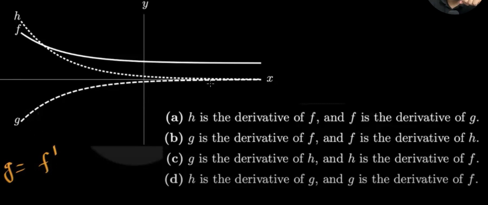

Great question! Let's clear up the confusion between **continuity** and **differentiability**:

---

## 🔹 What is Continuity?

A function is **continuous** at a point if:

1. The function exists at that point.
2. The limit exists at that point.
3. The value of the function and the limit are the same.

> Simply: **you can draw it without lifting your pen.**

Example:
$f(x) = x^2$ is continuous everywhere.

---

## 🔹 What is Differentiability?

A function is **differentiable** at a point if it has a **well-defined slope (derivative)** there — meaning it’s **smooth**, **no sharp corners**, and **no breaks**.

> You can not only draw it without lifting your pen, but it also has a **clear direction/slope** at every point.

---

## 🔑 Rule of Thumb:

> **If a function is differentiable at a point, it is also continuous at that point.**
> But the reverse is **not always true**.

---

### ✅ Summary Table:

| Condition                         | Meaning                              | Example                       |     |              |
| --------------------------------- | ------------------------------------ | ----------------------------- | --- | ------------ |
| Continuous but not differentiable | The graph has a sharp corner or cusp | ( f(x) =                      | x   | ) at $x = 0$ |
| Differentiable                    | Always continuous                    | $f(x) = x^2$, $f(x) = \sin x$ |     |              |

---

### 🔠So your question:

> Is differentiability stronger than continuity?

Yes ✅

- **Differentiability implies continuity**,
- But **continuity doesn’t guarantee differentiability**.

---

✅ **Yes — if a function is differentiable at a point, it is definitely continuous at that point.**
This is a **guaranteed rule** in calculus.

---

### 🔠In simple words:

- If a function is **differentiable**, it means the slope/tangent exists → so the graph **must be smooth and connected** there.
- Therefore, it is **automatically continuous** at that point.

---

### 📌 Important:

| Property              | Implies                 |
| --------------------- | ----------------------- |
| **Differentiable** ✅ | ⇒ **Continuous** ✅     |
| **Continuous** ✅     | ⇠**Differentiable** ⌠|

> So, all differentiable functions are continuous —
> but not all continuous functions are differentiable.

---

Great question! Let's dig into **why we can't draw a tangent line at $x = 0$ for $f(x) = |x|$** — even though the graph looks connected and continuous.

---

### 🔠First, recall what **differentiability** means:

To draw a tangent (i.e., to differentiate), the function must:

1. Be **continuous** ✅
2. Have a **well-defined, unique slope** from both left and right sides at that point

---

### 🧠 Let’s apply this to $f(x) = |x|$

- $f(x) = |x|$ is **continuous** everywhere (no breaks in the graph).
- But at $x = 0$, the **left-hand slope ≠ right-hand slope**.

---

### 📉 How the slopes behave at $x = 0$

- For $x < 0$, $f(x) = -x$ ⇒ slope = **–1**
- For $x > 0$, $f(x) = x$ ⇒ slope = **+1**

At $x = 0$, these two slopes **don't match**, so there's **no unique tangent line**.

---

### 📌 Key idea:

> A tangent line must “hug†the curve on **both sides** of the point.
> At a sharp corner (like $x = 0$ in $|x|$), there's no single line that does that.

So, **you can't draw a tangent** at that point.

---

### 📷 Visual Intuition:

Imagine driving along the graph of $|x|$ in a car:

- As you approach 0 from the left, your steering is pointing down (slope –1).
- As you pass 0 and go right, your steering points up (slope +1).

You have to **jerk the steering wheel** suddenly at $x = 0$ — that "jerk" means **no smooth tangent**, so **not differentiable** there.

---

Here's the graph of $f(x) = |x|$, and it explains **why we cannot draw a tangent at $x = 0$**:

- The **left-hand slope** (red dashed line) is −1.
- The **right-hand slope** (green dashed line) is +1.
- These two slopes **do not match** at $x = 0$, so the limit defining the derivative doesn't exist there.

This sharp turn is called a **cusp** or **corner**, and it's a point where:

- The function is **continuous**, but
- It is **not differentiable**.

So, **|x| is not differentiable at x = 0**, and that's why a **single tangent** can't be drawn there.

---

Great question!

No — **a tangent can only touch a curve at one point locally**, not two points. Here's why:

### 📌 Definition of Tangent:

A **tangent** is a straight line that:

- **Touches the curve at exactly one point**, and
- Has the **same slope** as the curve at that point (i.e., it represents the **instantaneous rate of change** at that point).

---

### ⌠Why Can’t a Tangent Touch at Two Points?

If a straight line touches a curve at **two points**, it’s no longer acting as a tangent — it’s called a **secant**.

> ✅ **Tangent** → touches at 1 point
> ✅ **Secant** → intersects at 2 or more points

---

### ✅ Example:

Take the parabola $y = x^2$:

- A **tangent** at $x = 1$ touches only at $(1, 1)$.
- A **secant** connecting $x = -1$ and $x = 1$ passes through both $(-1, 1)$ and $(1, 1)$.

---

### Exception?

There are **special curves** where a line might appear to “touch†at two points, like in circles or cusps, but that’s due to symmetry or flat regions — still, such a line is not technically a tangent in the normal sense.

---

You're asking a **very smart** and subtle question — and you're right to think deeper about it. Let's break it down clearly:

---

### â“ Your Question (Rephrased):

> If a **tangent** touches a curve at one point now, but the **curve keeps extending**, **could the tangent intersect or touch it again later**?

---

### ✅ Short Answer:

**Yes**, a line that is a **tangent at one point** **could** intersect the curve again somewhere **else**, **but it is still only a tangent at that one point**.

When it intersects again, it acts like a **secant** — **but it’s only tangent at the first point** because that’s where the slope matches.

---

### 📌 Example: Parabola

Take the graph of

$$
y = x^3
$$

Draw the tangent at the origin $(0, 0)$. The tangent line is flat — it’s the **x-axis**.

But wait!

As the curve goes far into the negative side, it eventually **crosses the x-axis again**.

So:

- The **x-axis is tangent at (0, 0)**.
- The **same line intersects the curve again** at another point.
- ✅ So it is **tangent once**, **intersecting** somewhere else.

---

### 🧠 Important Concept:

> A line can **intersect** a curve at multiple points but be **tangent at only one of them** — where the **slope of the curve = slope of the line**.

---

Excellent follow-up. Let’s clear up the **difference between a secant line and a tangent line**, especially when you're thinking about **2 points vs 1 point**:

---

### 🔹 **Secant Line** (Touches 2 points)

- A **secant** line is simply a **straight line** that **passes through two points** on a curve.
- It doesn't care about the **slope** at those points.
- It gives the **average rate of change** between the two points.

📌 **Formula**:
If two points are $(x_1, f(x_1))$ and $(x_2, f(x_2))$, then the slope of the secant line is:

$$
m_{\text{secant}} = \frac{f(x_2) - f(x_1)}{x_2 - x_1}
$$

---

### 🔸 **Tangent Line** (Touches 1 point)

- A **tangent** line is a line that:

  - **Touches the curve at exactly one point**
  - **Has the same slope** as the curve at that point (i.e., it matches the derivative there)

📌 It gives the **instantaneous rate of change** at that one point.

---

### 🔠Secant Line ✠Tangent Line

- If you move the two points of the **secant** line **closer and closer together**, the secant line becomes the **tangent line**.
- This process is what **limits** in calculus capture.

---

### 🧠 Final Clarity (Your Question Answered):

> "Does it mean the secant line is defined only between two fixed points, and tangent is just about one?"

✅ **Yes**:

- **Secant line**: About **two separate points** on the curve.
- **Tangent line**: About **one specific point**, where the slope of the curve and the line are the **same**.

But — a **tangent line** could **intersect** the curve again at a different point (like in $y = x^3$) — **but it is still only "tangent" at one point**, not both.

---

Great question! The answer is: **yes, a tangent can intersect the curve again later — but it's still only a "tangent" at the point of contact.** Let me explain clearly:

---

### ✅ **What makes a line a tangent?**

A **tangent line** is:

- A line that **touches the curve at exactly one point**, and
- At that point, it has the **same slope** as the curve (i.e. matches the derivative).

So the **"tangent" part only applies at that specific point**.

---

### 🔠Can it cross or touch again?

Yes, depending on the curve shape, the tangent line **may intersect** or **touch** the curve **again at some other point**, but:

> 🔸 It is not considered a "tangent" at that second point
> 🔸 It doesn’t need to have the same slope there
> 🔸 It’s just **intersecting**, like any other line can

---

### ğŸ“Example:

Take this curve:

$$
y = x^3 - 3x
$$

If you draw the tangent at the point $x = 1$, it touches the curve **there**, but if you extend it, the **same line will intersect the curve again** somewhere else.

Still — it’s only a **tangent** at $x = 1$. The other point is just an **intersection**.

---

### ✅ Summary:

| Feature                       | Description                                              |
| ----------------------------- | -------------------------------------------------------- |
| **Tangent**                   | Touches curve at one point, slope matches                |
| **Intersection later**        | Can happen, but it’s **not a tangent** at that new point |
| **Tangent means local match** | Only about slope & position **at one point**             |

---

Yes — exactly! You’ve got it. ✅

When we say:

> “A tangent line touches the curve at a point **and has the same slope** as the curve at that point,â€

we mean:

---

### 🔹 **The slope of the tangent = the derivative of the function at that point.**

That is:

$$
\text{Slope of Tangent at } x = a \quad = \quad f'(a)
$$

---

### 📌 Why?

Because the **derivative** of a function at a point $x = a$ tells us:

- How fast the function is changing
- The **instantaneous rate of change**
- The **slope of the curve** at that point

And a tangent line is **the line with exactly that slope**, passing through that point.

---

### 🧠 Simple Example:

Let’s say:

$$
f(x) = x^2
$$

Then:

$$
f'(x) = 2x
$$

At $x = 3$, the slope of the curve is:

$$
f'(3) = 2 \times 3 = 6
$$

So the **tangent line at $x = 3$** will have a slope of **6** — exactly the same as the curve’s slope at that point.

---

So yes, you're 100% right:

> **The slope of the tangent and the slope of the function are the same at the point of tangency.**

---

Great question — and it's one that **many students wonder about** when first learning about tangent lines!

---

### 🔠So how **can** a tangent have a slope if it touches only one point?

Let’s break it down step-by-step:

---

### 💡 1. **Slope normally needs two points**, right?

Yes — the usual formula for slope is:

$$
\text{slope} = \frac{y_2 - y_1}{x_2 - x_1}
$$

This needs **two distinct points**.

---

### ✅ 2. But in calculus, we use a smart trick:

We **start with two points** on the curve — then we move the second point **closer and closer** to the first one until they almost become the **same point**.

This gives us the **instantaneous rate of change**, which is the **derivative**.

---

### 🧠 This process is called a **limit**:

$$
f'(a) = \lim_{h \to 0} \frac{f(a + h) - f(a)}{h}
$$

That’s like finding the slope between:

- $(a, f(a))$ and
- $(a+h, f(a+h))$

And then shrinking the gap $h$ to **zero**.

---

### 📠What’s the result?

A line that just **touches the curve at one point** — but still has a slope, because we computed it as a **limit of nearby slopes**.

That’s what makes it **mathematically precise**.

---

### 🧭 Analogy:

Imagine zooming in on a curved road with a drone — the closer you zoom in, the more it starts to **look straight** at one point. That straight line is your **tangent**. Even though it touches just one point, you can still tell its slope — because you understand how the curve was moving _around_ that point.

---

So yes:

> A tangent line touches the curve at one point, but its **slope is defined using nearby points** through the concept of a **limit**.

---

Great question! Let's break it down step-by-step to make it clear:

### What is the slope of the curve?

- The **slope of the curve** at a particular point means how steep the curve is there.
- We find this slope by calculating the **derivative** of the function at that point.
- The derivative function, often written as $f'(x)$, gives the slope of the curve for any value of $x$.

### What is the slope of the tangent line?

- A **tangent line** to a curve at a point touches the curve **exactly at that point**.
- The slope of the tangent line is the same as the slope of the curve at that point.
- So, the slope of the tangent line = $f'(x_0)$, where $x_0$ is the point of tangency.

---

### How do we find the slope of the curve then?

1. Start with the function $y = f(x)$.
2. Find the derivative $f'(x)$. This derivative gives the slope of the curve at any $x$.
3. To find the slope at a specific point $x = a$, plug $a$ into the derivative: $f'(a)$.
4. This value $f'(a)$ is the slope of the curve at $x = a$ **and also the slope of the tangent line** at that point.

---

### Example:

Suppose $f(x) = x^2$.

- The derivative is $f'(x) = 2x$.
- At point $x = 3$, slope of curve $= f'(3) = 2 \times 3 = 6$.
- So, the tangent line at $x = 3$ has slope 6.

---

### Summary

- The slope of the **curve at a point** is given by the derivative.
- The **tangent line's slope** at that point is exactly the same as the curve's slope at that point.
- So, we find the slope of the curve by **finding the derivative** and evaluating it at the point of interest.

---

Exactly, you’re on the right track!

A **tangent line** is basically a straight line that just _touches_ the curve at one specific point — no cutting through or crossing there.

The main purpose of the tangent line is to help us **understand the slope** of the curve _at that exact point_. Since the curve can be curvy and complicated, the tangent line gives us a simple, straight-line approximation of how the curve behaves right there.

So yes:

- The tangent line is drawn **to understand and represent the slope of the curve at a point**.
- Its slope **matches** the slope of the curve exactly at that point.
- It only touches the curve at that one point (ideally).

Think of it like this: If you zoom in super close to the curve at that point, the curve _looks_ just like its tangent line.

---

Yes, exactly! Here’s a clear breakdown:

### 1. To find the slope of the curve at a point, we use the tangent line there.

- The tangent line _touches_ the curve at that point.
- The slope of the tangent line at that point **is the slope of the curve** at that point.

### 2. Can we have multiple tangent lines at different points on the curve?

- Absolutely!
- Every point on the curve (where the derivative exists) has its own tangent line with its own slope.
- So, **different points on the curve will generally have different tangent lines and different slopes.**

### 3. Can there be multiple tangent lines at the _same_ point?

- Usually, **no** — at a regular smooth curve point, there’s only one tangent line.
- But, there are exceptions:

  - At a **cusp** or a **corner** point (like the tip of an absolute value graph), there might not be a unique tangent line.
  - At some weird curves (like curves with vertical tangents), the tangent line may behave differently.

---

### Quick example:

- For $f(x) = x^2$, at $x=1$, slope = 2.
- At $x=2$, slope = 4.
- So, tangent lines at $x=1$ and $x=2$ are different lines with different slopes.

---

**Summary:**

- Tangent lines help us find the slope of the curve at a point.
- Different points → different tangent lines → different slopes.
- Usually, only one tangent line per point, except for special cases.

---

You’re very close, and your understanding is mostly right! Let me clarify and organize it so it’s clearer:

---

### Why do we use limits to find the slope of the tangent line?

- The tangent line’s slope at a point is the **instantaneous rate of change** of the function there.
- We **cannot directly measure** the slope of the tangent line by just looking at one point because slope needs two points to calculate (rise/run).
- So, we find the slope by looking at the slopes of **secant lines** (lines through two points on the curve) **getting closer and closer** to that point.
- This means we take the limit as the second point approaches the point where we want the slope.

Mathematically:

$$
\text{slope at } x = a = \lim_{h \to 0} \frac{f(a+h) - f(a)}{h}
$$

---

### Left-hand derivative (LHD) and Right-hand derivative (RHD)

- To say the derivative (slope) **exists at a point**, the limit from the left (LHD) and the limit from the right (RHD) **must be equal**.
- If LHD = RHD, the function has a **smooth slope** at that point — no sudden jump or sharp corner.
- This also means the function is **differentiable** at that point.

---

### Differentiability and continuity

- If a function is **differentiable** at a point, then it is **continuous** at that point.
- But, **continuity alone does NOT guarantee differentiability.**
  (Example: The absolute value function $f(x) = |x|$ is continuous everywhere but not differentiable at $x=0$ because of a sharp corner.)

---

### Summary in your words — corrected a bit:

- We find the slope of the tangent by taking the limit of the slopes of lines through points **closer and closer** to the point of interest.
- For the slope (derivative) to exist, the left-hand and right-hand limits of these slopes must be the same.
- This means the function has a **smooth slope** there, and the function is differentiable.
- Differentiability implies continuity (no gaps or jumps), but continuity alone does not guarantee differentiability.

---

Great question! Let me explain carefully.

---

### What is a secant line?

- A **secant line** is a line that passes through **two different points** on the curve.
- For example, points $(a, f(a))$ and $(a+h, f(a+h))$.
- Here, $a$ is the fixed point where we want to find the slope.
- $h$ is a small number that moves the second point $a+h$ close to $a$.

---

### Why use secant lines to find the tangent slope?

- The **tangent line** touches the curve at exactly one point $(a, f(a))$, but to find its slope, we need two points.

- So, we first consider the **secant line** that passes through two points $(a, f(a))$ and $(a+h, f(a+h))$.

- The slope of this secant line is:

  $$
  \frac{f(a+h) - f(a)}{(a+h) - a} = \frac{f(a+h) - f(a)}{h}
  $$

- Now, as $h$ gets smaller and smaller (meaning $a+h$ gets closer to $a$), the secant line becomes closer and closer to the tangent line.

- The **limit** of these secant slopes as $h \to 0$ gives the slope of the tangent line.

---

### So what is $a+h$?

- $a+h$ is just another point on the curve **close to $a$**.
- When $h$ is positive, $a+h$ is a point to the **right** of $a$.
- When $h$ is negative, $a+h$ is a point to the **left** of $a$.
- By considering both sides, we check if the slope approaches the same value from the left and right.

---

### Summary:

- **Secant line:** connects two points on the curve, $a$ and $a+h$.
- **Tangent line slope:** limit of secant line slopes as $h \to 0$.
- $a+h$ is just the second point on the curve near $a$, not the tangent point itself.
- This process lets us find the exact slope of the tangent line at $a$.

---

Awesome question! Here’s why the **left-hand derivative (LHD)** and **right-hand derivative (RHD)** must be the same for the slope (derivative) to be considered **smooth** or exist at a point:

---

### What happens if LHD ≠ RHD?

- The slope from the **left side** (approaching the point from smaller $x$ values) gives one value.
- The slope from the **right side** (approaching from larger $x$ values) gives a different value.
- This means the slope suddenly **jumps** or **changes abruptly** at that point.
- So, the function has a **corner or sharp bend** there — no smooth transition.
- Because the slope isn’t consistent from both sides, the derivative **does not exist** at that point.

---

### Why must LHD = RHD for smooth slope?

- A **derivative** at a point means the slope of the curve is well-defined there.
- For a slope to be well-defined, approaching the point from both sides must give the **same slope value**.
- When both match, the slope is **smooth** — no sudden jumps or corners.
- This means the curve is locally “flat†enough that a single tangent line fits perfectly.

---

### Intuition:

- Imagine driving on a road (the curve).
- If the slope from the left and right differ, it’s like hitting a sharp turn or cliff edge — sudden change.
- If they’re equal, the road bends smoothly — easy to stay on a steady slope.

---

### Summary

| Condition | Meaning                      | Derivative Exists?         |
| --------- | ---------------------------- | -------------------------- |
| LHD = RHD | Slope approaches same value  | Yes, smooth slope exists   |
| LHD ≠ RHD | Slope jumps/different values | No, sharp corner, no slope |

---

RELATED TO LEFT QUESTION

Perfect. Let’s calmly re-analyze the graph you uploaded (📠_CalculusDoubtD1.png_) step by step.

---

### 🧠 What We’re Trying to Find:

We want to answer:

> “Which function is the derivative of which?â€
> That is — how are $f(x)$, $g(x)$, and $h(x)$ connected?

---

### ✅ Step 1: Understand the meaning of derivative

If a function is:

| Behavior of function    | Its slope (derivative) |
| ----------------------- | ---------------------- |
| Increasing (going up)   | Positive slope ( > 0 ) |
| Flat (no change)        | Zero slope (= 0)       |
| Decreasing (going down) | Negative slope ( < 0 ) |

So:

- A function’s **derivative** shows how fast it’s going up or down.
- A function’s **second derivative** shows how the slope itself is changing (concave up/down).

---

### ✅ Step 2: Let’s Analyze Each Curve in the Image

#### 🔹 Curve $f(x)$ (middle one):

- It’s **always going down**, slowly at first, then more steeply.
- So its slope is:

  - **Negative**, getting more negative.

- That means:

  $$
  f'(x) < 0 \text{ and decreasing}
  $$

#### 🔹 Curve $g(x)$ (dotted line below):

- It is **below the x-axis** (so it’s negative)
- And it’s **decreasing** → that matches the slope of $f(x)$
- So, this could be the **first derivative** of $f(x)$

✅ So:

$$
g(x) = f'(x)
$$

#### 🔹 Curve $h(x)$ (top one):

- It is **curving gently** — it's **concave down**
- It looks like the **function whose slope is $f(x)$**

✅ So:

$$
f(x) = h'(x)
$$

---

### 🧩 Final Relation:

If:

- $g = f'$
- $f = h'$

Then:

$$
\boxed{g = f' = h''}
$$

So the final answer is:

> ✅ **Option (b)**:
> **g is the derivative of f**, and **f is the derivative of h**

---

Great question! You're asking:

> 🔠"If $h$ is the derivative of $f$, does that mean $h$ is like the tangent or slope of $f$?"

---

### ✅ Short Answer:

Yes — **if $h = f'$**, then:

- $h(x)$ tells you the **slope** of the graph of $f(x)$ at every point.
- It is **not** the tangent **line** itself — but the **slope** (or steepness) of that tangent.

---

### 🯠Clear Explanation:

Imagine you’re walking along the curve of $f(x)$. At each point:

- The **slope** of the curve at your footstep = $f'(x)$
- That slope = a **number** (could be +, −, or 0)
- That number is the **height of $h(x)$** at that point.

So:

| At $x$     | What happens in $f(x)$? | What does $h(x) = f'(x)$ show? |
| ---------- | ----------------------- | ------------------------------ |
| Increasing | Slope is positive       | $h(x) > 0$                     |
| Flat       | Slope is 0              | $h(x) = 0$                     |
| Decreasing | Slope is negative       | $h(x) < 0$                     |

---

### 📌 So, to clarify:

- **$h(x)$** is the **slope function** of $f(x)$
- It tells you what the **tangent line’s slope** would be at each point of $f(x)$
- But **$h(x)$** itself is **not a tangent line** — it’s a function!

---

Would you like a **diagram** showing $f(x)$ with tangent lines and how those match values on $h(x)$? That makes this crystal clear.
